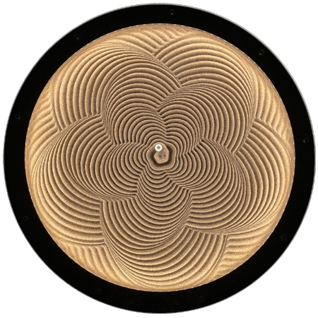

# Polar Sandbox

The Polar Sandbox was designed and built by Stan Reifel, one of Olin’s instructors for *Principles of Integrated Engineering*. The work was done in the fall of 2019, during the same 8 week period that his students had to complete their projects. His intention was to provide an example of what’s possible using the same tool available to them (Solidworks, 3D printing, laser cutting, CNC routing, and the Arduino IDE). 

In this repository are the design files for this project, including mechanical, electrical and software.

The idea for the Polar Sandbox came from Bruce Shapiro, an artist known for his work in kinetic sculpture. He is credited as the original inventor of the “Sand Table”.  

This project is dedicated to Aaron Hoover whose work in education, engineering, and design has been a constant source of inspiration. He is missed.

## More information:

More information about the Polar Sandbox can be found here:

​    http://reifel.org/polarsandbox

## License:

Copyright (c) 2021 S. Reifel & Co.
